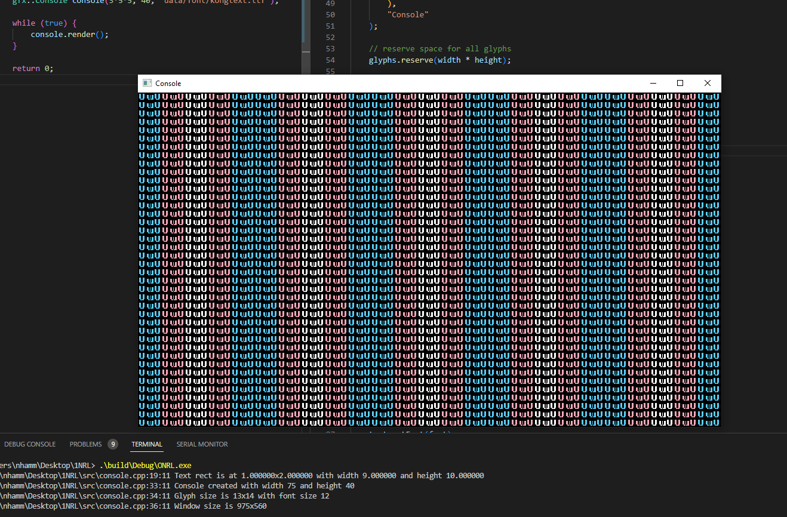
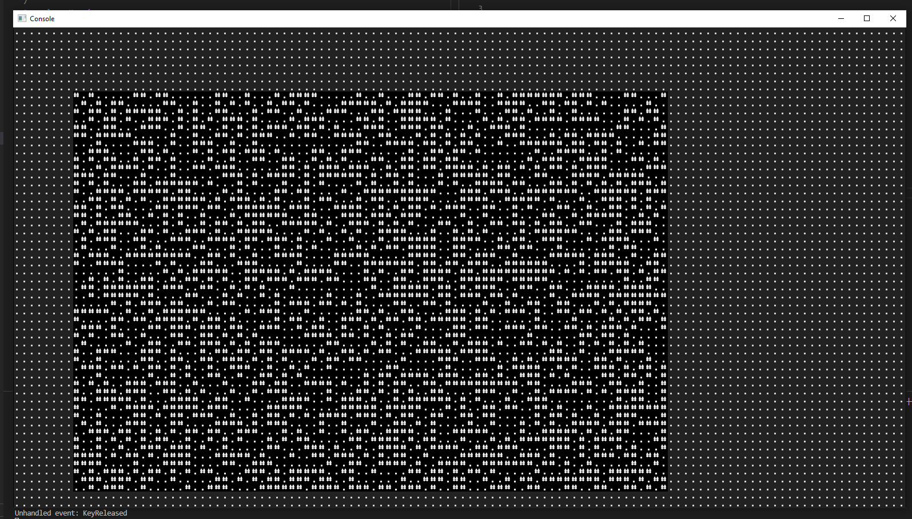
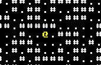

# ONRL - _One Night RogueLike_

## Foreword

In the interest of providing Sunday an example of my gamedev work, I'm going to vomit up a quick and dirty roguelike. I'm going to use C++ and SFML, because I'm familiar with them.

Devlog will be fairly informal. I'll try to keep it up to date as I go.

----

## Notes
- Requires C++20 for [<source_location>](https://en.cppreference.com/w/cpp/utility/source_location)

## Devlog

----
### June 7, 2023 @ 10:37PM

I've got a window up and running.
I spent some time fiddling around with padding to get the gutter between the glyph grid uniform on all sides. Wasn't necessary, but it was annoying me >_>;

----
### June 8, 2023 @ 12:42AM

i made a map class. (and a homemade pizza. it was great.)
no actual map generation yet, just a random 2d array of tiles.
Spent a while reading about map gen stuff. I'll probably just do some bsp + some CA style annealing to "smoof" it out.

----
### June 8, 2023 @ 4:35PM

👀 Sorry I haven't pushed this up to github yet lol.

I actually won't be around this weekend, since on Friday I'm going up north to visit my mother, and I won't be back until Sunday night or mid-Monday. I know time is pressing, but it'll certainly be something "playable" before I go.

I slapped down some crusty code to get a player on the screen, so here's that.

Just arbitrarily dropping him at `5, 5` for now, and there's some basic collision checks.

## TODO

    - [x] Make a window.
    - [x] Make a player, let it walk around.
    - [x] Make a map
    - [x] let the player walk around in the map.
    - [ ] Proper Map Generation
    - [ ] Make a monster, let it walk around (brownian?)
    - [ ] Time Systems
        - [ ] Make a turn clock
        - [ ] Entities act when $SPEED ticks have passed.
    - [ ] Combat
        - [ ] Player can attack monster
        - [ ] Monster can attack player
        - [ ] Monster can die
        - [ ] Player can die
    - [ ] Items
        - [ ] Player can pick up items
        - [ ] Player can drop items
        - [ ] Player can use items
        - [ ] Items can be weapons
        - [ ] Items can be armor