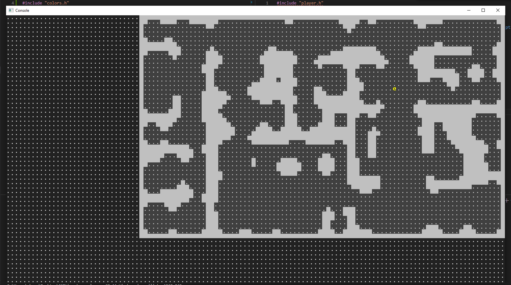
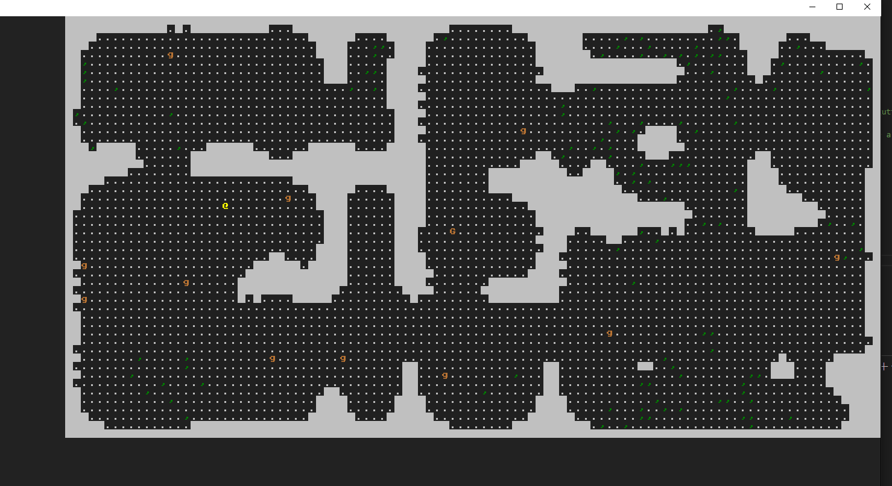

# ONRL - _One Night RogueLike_

## Foreword

In the interest of providing Sunday an example of my gamedev work, I'm going to vomit up a quick and dirty roguelike. I'm going to use C++ and SFML, because I'm familiar with them.

Devlog will be fairly informal. I'll try to keep it up to date as I go.

----

## Building and Running

Should be similar on both Windows and Linux -- cmake should take care of the dependencies and whatnot. I've only tested on Windows, though.
```bash
git clone "https://github.com/nhammond129/ONRL"
cd ONRL
mkdir build
cmake -B build -S .
cmake --build build
./build/ONRL || build/Debug/ONRL.exe
```

----
## Controls

vi-like movement: `hjkl` for left, down, up, right (respectively.)

----
## Notes
- Requires C++20 for [<source_location>](https://en.cppreference.com/w/cpp/utility/source_location) \
  But otherwise it's pretty standard.

- The console rendering is terribly crude, but it should let me do some pretty cute things with how the world looks. I don't have anything fancy -yet- but some noise in the colors used for walls/floors/etc would be super easy.

----
## Devlog

### June 7, 2023 @ 10:37PM

I've got a window up and running.
I spent some time fiddling around with padding to get the gutter between the glyph grid uniform on all sides. Wasn't necessary, but it was annoying me >_>;


### June 8, 2023 @ 12:42AM

i made a map class. (and a homemade pizza. it was great.)
no actual map generation yet, just a random 2d array of tiles.
Spent a while reading about map gen stuff. I'll probably just do some bsp + some CA style annealing to "smoof" it out.


### June 8, 2023 @ 4:35PM

👀 Sorry I haven't pushed this up to github yet lol.

I actually won't be around this weekend, since on Friday I'm going up north to visit my mother, and I won't be back until Sunday night or mid-Monday. I know time is pressing, but it'll certainly be something "playable" before I go.

I slapped down some crusty code to get a player on the screen, so here's that.


Just arbitrarily dropping him at `5, 5` for now, and there's some basic collision checks.

### June 8, 2023 @ 6:35PM

I've got a basic map generator working. It's a simple BSP, with some cellular automata to smooth it out into something more cave-y. Refactored map tiles.



### June 8, 2023 @ 11:18PM

Made dinner, ate dinner, did some packing, and threw together some monster stuff.
Also, I forgot I also had a doctor's appointment tomorrow, so I'll have less time than I thought. I'll probably be able to throw on some more stuff in the morning.

They walk around and eat "moss" (green `,` tiles), walking randomly otherwise.
I tinkered around with better ideas of things to do with the moss, but none of what I was doing looked aesthetically pleasing, so it's just sorta... _there_ for now.




## TODO

    - [x] Make a window.
    - [x] Make a player, let it walk around.
    - [x] Make a map
    - [x] let the player walk around in the map.
    - [x] Proper Map Generation
    - [x] Make a monster, let it walk around (brownian?)
    - [x] Time Systems
        - [x] Make a turn clock
        - [x] Entities act when $SPEED ticks have passed.
    - [x] Moss?
    - [ ] UI
        - [ ] Player status (left column) (just need to draw text there regularly)
        - [ ] Message log (bottom region) (fixed-size queue)
        - [ ] Dialog boxes (overlaid, centered)
    - [ ] Combat
        - [ ] Player can attack monster
        - [ ] Monster can attack player
        - [ ] Monster can die
        - [ ] Player can die
    - [ ] Items
        - [ ] Player can pick up items
        - [ ] Player can drop items
        - [ ] Player can use items
        - [ ] Items can be weapons
        - [ ] Items can be armor